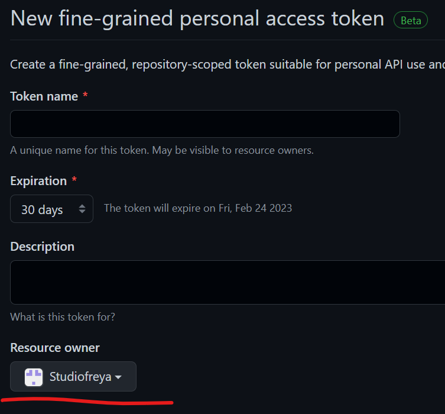

# Dockerized GitHub Runner with OpenSUSE Tumbleweed for Hugo

Most of the contents in this repository is copied from https://github.com/tcardonne/docker-github-runner

It has been modified to work with Tumbleweed.

Thank you Thomas for using a very permissible license.

## Motivation

The main motivation for this runner is to have a GitHub runner with a recent version of Hugo.

The base image for tcardonne/docker-github-runner is using Debian Buster and the current version of Hugo is `0.55.6+really0.54.0-1`. Yes, really: https://packages.debian.org/buster/hugo

OpenSUSE Tumbleweed is almost bleeding edge, and is very quick in updating to the latest version of Hugo, and other software, after a release.

Given the differences between Debian Buster and OpenSUSE Tumbleweed, I decided to just copy the relevant pieces and create a new repository for this Docker image.

Given the update cadence for Tumbleweed, there is no point in pushing this image to Docker hub. It will be outdated in a day or so.

## Usage

### Build with makefile:

```bash
make build
```

### Or build with `docker` command:

```bash
docker build -t github-runner-hugo docker/
```

### Create a GitHub PAT token

Head over to https://github.com/settings/personal-access-tokens/new to create a token. It must have `manage_runners:org` permission.

#### Select resource owner

If you are planning to create a GitHub Runner for an organization, make sure the org is selected under _Resource owner_.

  

### Create `.env` file

1. Copy `.env-sample` to `.env`. It should be something like the following.
2. Copy the generated PAT into `GITHUB_ACCESS_TOKEN`.


```ini
### Uncomment for specific repository
# RUNNER_REPOSITORY_URL=https://github.com/user/repo

### URL for organization
RUNNER_ORGANIZATION_URL=https://github.com/example_org

### Github Personal Access Token, with org-access/repo-access for managing runners (manage_runners:org)
### https://github.com/settings/personal-access-tokens/new
GITHUB_ACCESS_TOKEN=github_pat_xxxxxxxxx_aaaaaaaaaa
```

### Start

```bash
docker-compose up -d
```

### Check logs

```bash
docker logs -ft github-docker-selfhosted-runner-runner-1
```

If all is well the last entries should be similar to:

```
Started running service

√ Connected to GitHub

Current runner version: '2.301.1'
Listening for Jobs
```

## Example workflow for building a site with Hugo and deploy on Netlify

This file must be in folder `.github/workflows` in your Hugo site repository. It can be called anything. In my repo I call it `build-site.yml`.

Your Netlify Personal Access Token (PAT) must be stored in the secrets section of your GitHub repository with name `NETLIFY_AUTH_TOKEN`.

```yml
name: Build Hugo Site
run-name: Building site from commit ${{ github.sha }} pushed by ${{ github.actor }}.
on:
  # Runs on pushes targeting the default branch
  push:
    branches: ["main"]
env:
  # Netlify Site ID
  NETLIFY_SITE_ID: 010185f3-aaaa-bbbb-cccc-dddddddddddd

jobs:
  Build-Hugo-Site:
    runs-on: self-hosted
    steps:
      - run: echo "🎉 The job was automatically triggered by a ${{ github.event_name }} event."
      - run: echo "🐧 This job is now running on a ${{ runner.os }} server"
      - run: echo "🔎 The name of your branch is ${{ github.ref }} and your repository is ${{ github.repository }}."
      - name: Check out repository code
        uses: actions/checkout@v3
        with:
          submodules: true
      - run: echo "💡 The ${{ github.repository }} repository has been cloned to the runner."
      - name: List files in the repository
        run: |
          ls ${{ github.workspace }}
      - run: hugo --minify --gc --cleanDestinationDir --destination public
      - run: netlify deploy --auth ${{ secrets.NETLIFY_AUTH_TOKEN }} --prod --dir public/
      - run: echo "🍏 This job's status is ${{ job.status }}."
```

This workflow will only trigger when pushed to `main`. Any other branch will not trigger a build and deploy. This enables having multiple development-branches for unfinished features and stories for your site.